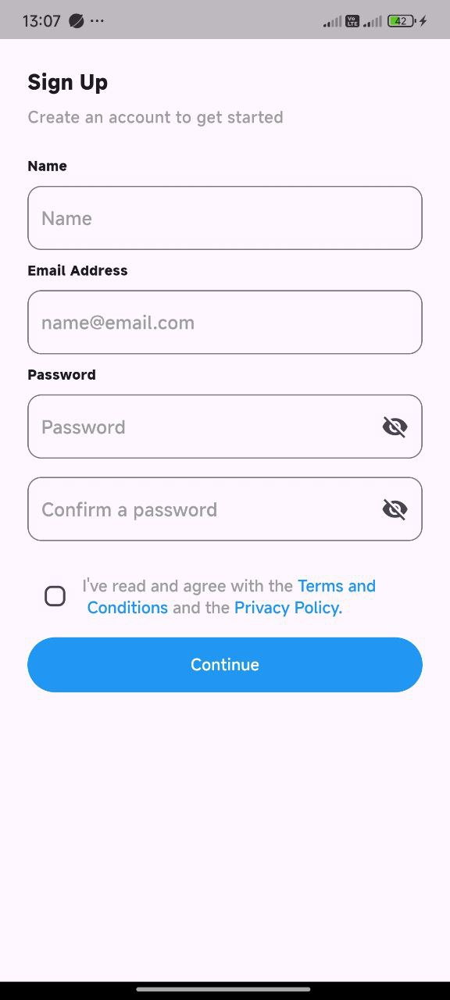

# login_ui

A Flutter project demonstrating login, sign-up, and confirmation code screens with a clean and intuitive user interface.

---

## About the project

This project features a simple and modern login/sign-up flow built with Flutter. It includes input fields with validation and a confirmation code screen for verifying users via a 4-digit code.

---

## Screenshots

  



---

## Requirements

- Flutter SDK version 3.0.0 or higher
- IDE: Android Studio, VS Code, or other compatible editors
- Emulator or physical device connected for testing

---

## Installation & Running

1. Clone the repository:

   ```bash
   git clone https://github.com/yourusername/login_ui.git

   ```
