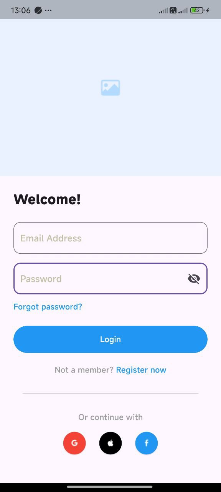
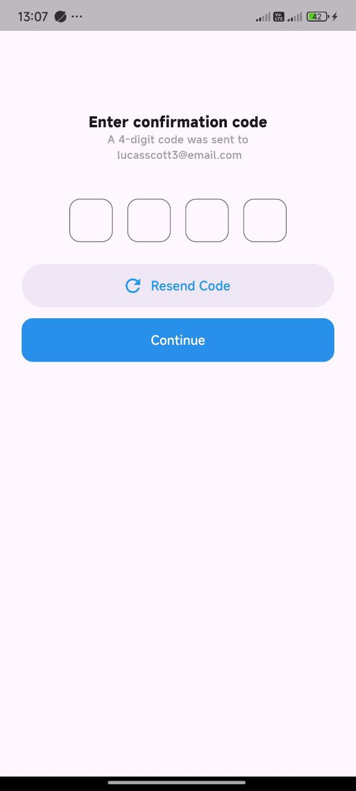

# login_ui

A Flutter project demonstrating login, sign-up, and confirmation code screens with a clean and intuitive user interface.

---

## 📱 About the Project

This project features a simple and modern login/sign-up flow built with Flutter. It includes:

- Clean UI layout
- Input fields with visibility toggle
- Checkbox styling
- Code confirmation screen (4-digit input)

---

## 🖼️ Screenshots

<div align="center">
  
  
  
</div>

---

## 🛠️ Requirements

- **Flutter SDK**: version 3.0.0 or higher
- **IDE**: Android Studio, VS Code, or IntelliJ
- **Device**: Emulator or physical Android/iOS device

---

## 🚀 Installation & Running

1. **Clone the repository:**

   ```bash
   git clone https://github.com/ByteHunter833/Mobile-Apps-Prototyping-Kit.git
   ```

2. **Navigate to the project folder:**
   ```bash
   cd Mobile-Apps-Prototyping-Kit/login_ui
   ```
3. **Install dependencies**

```bash
   flutter pub get
```

4. **Run the app**

```bash
   flutter run
```

## 🔍 Features

- **Eye icon toggle to show/hide password**
- **Styled checkboxes for terms & conditions**
- **Smooth screen transitions**
- **Focus shifting between confirmation code input boxes**

##📂 Project Structure

```bash
login_ui/
│
├── lib/
│   ├── main.dart
│   ├── sign_up.dart
│   └── confirmation_code.dart
│
├── screenshots/
│   ├── login_screen.jpg
│   ├── confirmation_code.jpg
│   └── sign_up_screen.jpg
│
├── pubspec.yaml
└── README.md

```
